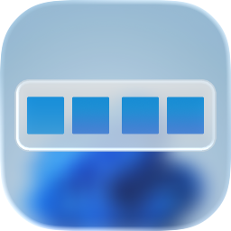
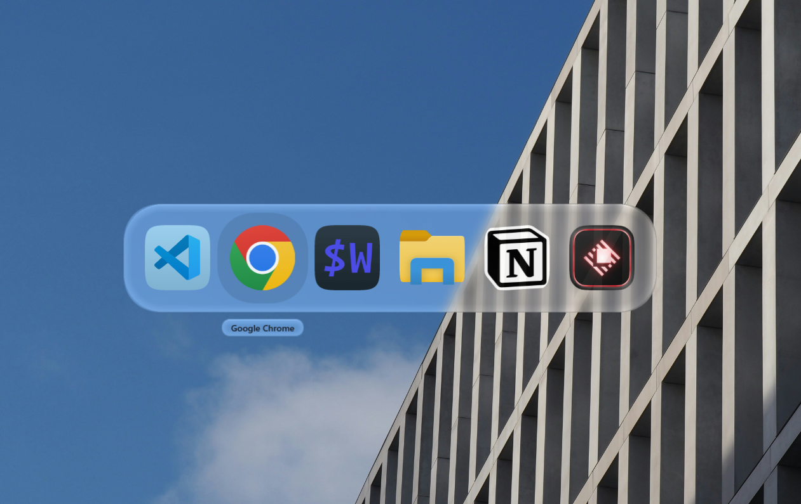
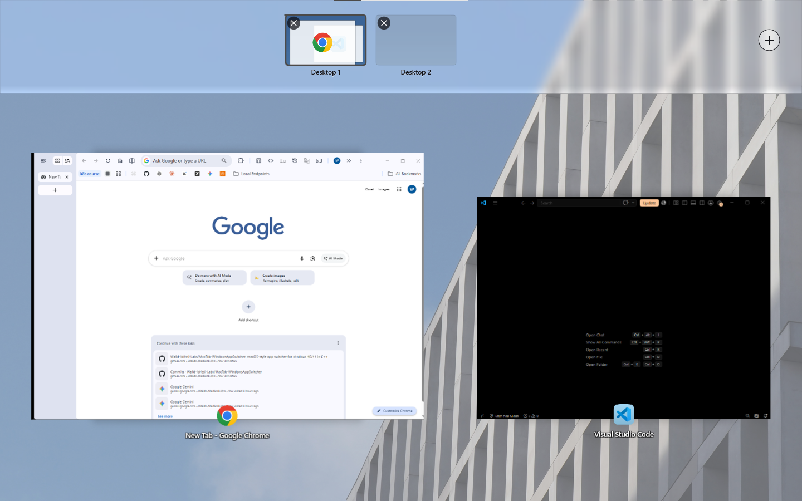

  

<h1 align="center">MacTab</h1>

An application switcher for Windows 10 and 11.

  

Alt+Tab lists every open window as a grid of thumbnails. MacTab lists
applications instead: one large icon each, ordered by when they were last used,
on a glass panel above the desktop. The panel appears within a frame of the key
being pressed and closes as soon as Alt is released.

[Download the latest release](https://github.com/Walid-Idrissi-Labs/MacTab-WindowsAppSwitcher/releases)

## Switching

Hold Alt and press Tab. Each press moves the selection to the next application.
Releasing Alt switches to the one selected.

| Key | Action |
|---|---|
| `Alt+Tab` | Next application, most recently used first |
| `Alt+Shift+Tab` | Previous application |
| `←` `→` | Same as Tab and Shift+Tab |
| `Alt+` `` ` `` | Cycle through the windows of the selected application |
| `↓` | Expand the selected application into its windows |
| `Q` | Quit the application |
| `W` | Close one window |
| `H` | Minimise every window the application has open |
| `Esc` | Close the panel without switching |
| Mouse | Hover to select, click to switch |

A short press and release switches to the previous application without showing
the panel at all. This is the common case, and it costs nothing to draw. The
panel appears only when Alt is held longer than `RevealDelayMs`, which is 180
milliseconds by default.

Windows are grouped by the application that owns them, so a browser with several
windows open occupies a single tile rather than crowding out everything else.
Pressing `↓` expands that tile into the individual windows when a specific one
is needed.

`Q` sends `WM_CLOSE` to every window of the selected application, which is the
same message the close button sends, so an application with unsaved work can
still prompt before it exits. Nothing is force-terminated. `W` closes a single
window, and `H` minimises all of them.

## Mission Control

Mission Control arranges every open window so that none of them overlap, across
all displays at once, with the virtual desktops in a bar along the top.

It is disabled by default and is enabled from the tray menu under *Settings*.
Alt+Tab is the primary function of this program, and binding a second system
shortcut without being asked is a larger imposition than binding the first.

Once enabled, `Win+Tab` opens it. Windows are placed close to where they already
were, so they can be found by position rather than by reading labels.

| Action | |
|---|---|
| Arrow keys | Move between windows by position rather than through a list |
| Click a pile, or `↓` | Spread one application's windows apart |
| Click a desktop | Show that desktop's windows |
| Click the `+` | Add a virtual desktop |
| Drag | Move a window to another display |
| `Esc` | Leave |

Viewing another desktop is not the same as switching to it. Its windows are
shown, but the switch happens only on leaving. The overlay belongs to the
desktop it was opened on, and switching underneath it would leave a full-screen
window on a desktop that is no longer visible.

## Settings

The tray menu covers which display the panel appears on, light or dark
appearance, and the glass.

The glass is off by default. When enabled, the panel captures the desktop behind
it, blurs it, and refracts it at the rim. This costs one screen capture per
gesture.

Everything else is in `%LOCALAPPDATA%\MacTab\settings.ini`, which is written on
first run with a comment above every key. Saving the file applies the changes
immediately, with no restart.

### Other Helpful Settings

`LeftAltOnly` is enabled, and should stay that way on French, Arabic and other
layouts where AltGr produces `@ # { } [ ]`. AltGr is Ctrl plus Right Alt, and
without this setting the switcher would open while typing an email address.

`RevealDelayMs` sets how long Alt must be held before the panel appears.

## Lightweight

The binary is about 800 KB. No runtime, no framework and nothing to
install alongside it; the C runtime is linked statically.

Nothing runs while the switcher is idle. No timers, no polling loops
and no background threads at rest. The only active component is a Windows event
hook that fires when the foreground window changes, which is what keeps the
application order current. The program contains one timer, and it exists between
the first Tab and the release of Alt.

The panel is constructed once at startup and stays not torn down. The window, the
GPU devices and the visual tree are all created before the first gesture, so
showing it is a window move and a few property writes rather than a build.

Holding Alt+Tab costs no CPU in this process. The fade, the scale and the
selection highlight are Composition animations, which DWM runs on its own
thread.

Icons are cached in memory and on disk as finished pixels. From the second
launch onward, an application that has been seen before costs one file read.

`MacTab.exe --diag` writes a log containing real timings for each of these paths.

## Technical Details

Native C++20 against Win32 and Windows.UI.Composition. Static CRT, no framework,
nothing to redistribute. The floor is Windows 10 1803 (build 17134), which is
where the Composition visual layer becomes usable from a desktop process.

### Input

`RegisterHotKey` cannot bind Alt+Tab, because Windows reserves it, so the
gesture is driven by a `WH_KEYBOARD_LL` hook. The hook runs on its own thread
and owns the state machine, since whether to swallow a key is the callback's
return value and cannot be deferred to another thread. It only ever posts to the
UI thread, never sends, because a hook that exceeds `LowLevelHooksTimeout` is
removed by Windows with no notification. The callback allocates nothing, takes
no locks and performs no I/O.

### Window list

Enumerated per gesture with `EnumWindows`, filtered to the shell's own criteria:
visible, not cloaked by `DWMWA_CLOAKED`, not `WS_EX_TOOLWINDOW` unless also
`WS_EX_APPWINDOW`, and either unowned or owned with `APPWINDOW`. Enumeration is
around a millisecond, so there is no live list to invalidate.

UWP windows are hosted by `ApplicationFrameHost`, so identity is resolved
through the `CoreWindow` child rather than the frame, otherwise every packaged
application collapses into one entry. The grouping key is the AUMID for packaged
applications and the canonical executable path for everything else. Ordering is
maintained continuously from an `EVENT_SYSTEM_FOREGROUND` hook.

### Panel

A single topmost, non-activating window created at startup:
`WS_EX_NOREDIRECTIONBITMAP` so it has no redirection surface of its own and
Composition owns every pixel, and `WS_EX_NOACTIVATE` so it never takes
foreground from the window being switched to. It carries a
`DesktopWindowTarget` and a visual tree that is never rebuilt, so showing the
panel is `SetWindowPos` plus property writes. Having no redirection surface also
means there is nothing to hit-test against, so mouse input is resolved against
the layout rather than against child windows.

Composition is used because of the corner radius. The panel's corner is 62
pixels; DWM rounds windows at about 8 and takes no parameter, and
`SetWindowCompositionAttribute` blurs the whole window rectangle, so confining
it to a rounded shape means `SetWindowRgn`, which has no antialiasing at all.
Composition clips a blurred surface to arbitrary geometry with real coverage.

The backdrop is a single captured frame rather than a live effect, which avoids
an `IGraphicsEffect` graph and the Win2D dependency that normally comes with it.
Capture tries Desktop Duplication first, then two GDI paths, and falls back to a
flat tinted plate when all three return nothing usable.

The panel outline and the icon corners are superellipses whose exponents were
fitted rather than chosen: boundary points recovered from a reference image, then
a least-squares sweep over the shape origin, corner extent and exponent. The
panel came out at extent 214 and exponent 2.24, residual 0.013 over 35 points;
the icon corner at 106 and 2.46. The difference matters, because using the
icon's exponent for the panel makes it read as a rounded rectangle. Constants
are in [`src/panel_layout.h`](src/panel_layout.h).

### Icons

`IShellItemImageFactory` will not enlarge past the largest frame an application
ships, and returns a smaller icon centred in the requested canvas with nothing
to indicate it. MacTab reads `RT_GROUP_ICON` from the executable instead and
takes the largest frame, which since Vista is a PNG at 256. Packaged
applications are resolved through their package family to `AppxManifest.xml` and
the unplated logo asset, because the icon the shell returns for those has
already been composited onto the manifest background colour.

Backgrounds baked into an icon are removed with a flood fill inward from the
border, rather than a colour key, since padding reaches the border and the dark
half of a logo does not. What remains is measured to classify it as full-bleed
artwork or a glyph, then masked into a squircle. Finished tiles are cached in
memory as an LRU and on disk keyed by the source executable's timestamp.

## Known limitations

- **Elevated windows.** A process running as a normal user cannot receive
  keyboard input directed at a window running as administrator, so the built-in
  switcher takes over while such a window has focus. The correct fix requires a
  signed binary installed under Program Files.
- **The Start menu draws above the panel.** Shell flyouts occupy a z-band above
  topmost windows that a normal process cannot enter.
- **Windows 10 before build 17134 is unsupported**, which is the minimum for
  Windows.UI.Composition.
- **Dragging a window to another virtual desktop can be unreliable.** The public API
  permits a process to move only its own windows between desktops. The attempt
  is made and the window returns to its place when Windows refuses, rather than
  appearing to succeed.
- **Desktop miniatures show window positions, not contents.** A window on
  another desktop is cloaked, and DWM will not compose a cloaked window through
  any interface available to a normal process.
- **Mission Control holds its backdrop on the GPU** while enabled, at the
  display's resolution, which is roughly 33 MB per 4K display. This is the cost
  of not blurring it; `MissionBlurSigma` above 1 halves it.
- **HDR displays use a slower capture path.** Desktop duplication returns float
  pixels when HDR is active, and the conversion has not been implemented.

## SmartScreen and antivirus

The binary is not code-signed, so Windows will report an unrecognised publisher.
Select *More info*, then *Run anyway*.

Antivirus software may also flag it. MacTab installs a global low-level keyboard
hook, which is the same mechanism a keylogger uses. The hook is unavoidable:
Windows reserves Alt+Tab and provides no other way for an application to bind
it. The implementation is in [`src/hotkey.cpp`](src/hotkey.cpp), roughly five
hundred lines, and can be read before the program is trusted. Do not disable
antivirus software to run this.

## Licence

GNU General Public License v3.0. The full text is in [LICENSE](LICENSE).

Copyright (C) 2026 Walid Idrissi.

Modified versions and redistributed builds must carry the same licence and make
their source available.
